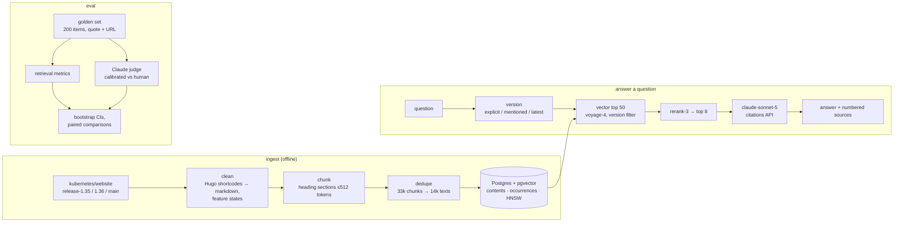

# k8s-docs-rag

Q&A over the official Kubernetes documentation, with sentence-level citations, Kubernetes-version awareness, and an evaluation pipeline that reports every change as a number with a confidence interval.

> **Status:** evaluation, experiments, API and UI done; deployment pending. See [`plan.md`](plan.md) for the design and milestones.

## Local setup (macOS)

```sh
brew install uv postgresql@18 pgvector
brew services start postgresql@18
/opt/homebrew/opt/postgresql@18/bin/createdb k8s_docs_rag

uv sync                              # installs Python 3.14 + dependencies
cp .env.example .env
uv run python -m scripts.init_db     # enables pgvector
uv run pytest                        # DB tests use a throwaway k8s_docs_rag_test database

uv run python -m ingest.fetch        # docs at the commits pinned in ingest/sources.lock.json
uv run python -m ingest.clean        # Hugo shortcodes -> markdown, data/clean/v<version>/
uv run python -m ingest.chunk        # heading-based chunks, data/chunks/v<version>/
uv run python -m ingest.dedupe       # one entry per unique text, data/index/plain/
uv run python -m ingest.load         # into Postgres as index "heading-plain"
uv run python -m ingest.embed        # voyage-4 vectors + HNSW index (needs VOYAGE_API_KEY)
```

Golden set (`eval/dataset/{dev,test}.jsonl`) checks: schema, dev/test leakage, and that every evidence quote exists in its version's docs, in the section its URL names:

```sh
uv run python -m eval.validate
uv run python -m eval.run_retrieval                    # retrieval metrics on dev, no LLM calls
uv run python -m eval.run_generation --max-usd 2.5     # answers via the Batches API
uv run python -m eval.judge --run dev-baseline --model claude-haiku-4-5 --max-usd 1.1
uv run python -m eval.report                           # experiments/results.md
```

Ask a question (needs `ANTHROPIC_API_KEY`):

```sh
uv run python -m rag.ask "How do I roll back a Deployment?" --version 1.36 --show-chunks
```

Run the service (FastAPI on :8000, Next.js on :3000, which proxies `/api` to it):

```sh
uv run uvicorn api.main:app            # LIVE_ANSWERS=true to let /ask call Claude
cd web && npm install && npm run dev   # http://localhost:3000, eval dashboard at /eval
```

Live answers are off by default because they spend the operator's Claude budget; the UI then shows the answers from the latest eval run and still runs retrieval live.

`ingest.fetch --update --versions 1.35 1.36 1.37` re-pins each version to its branch tip: `release-1.xx` if that branch exists, else `main` (which documents the current release).

Claude calls are metered the same way in `data/usage/anthropic.jsonl`: before each request its worst case (input tokens from the free `count_tokens` endpoint, plus `max_tokens` of output) is checked against `ANTHROPIC_BUDGET_USD` (default $5), and a lost response is booked at its worst case. Voyage calls are metered in `data/usage/voyage.jsonl`; any request that could push the total past `VOYAGE_TOKEN_BUDGET` (default 30M, the free allowance is 200M) is refused before it is sent. Vectors are cached in `data/embeddings/`, so rebuilding the database costs nothing.

## Architecture



- `ingest/`: fetch → clean → chunk → dedupe → load → embed; every stage writes files, so each is rerunnable and testable.
- `rag/`: version choice, retrieval (vector / keyword / hybrid, rerank), generation with the Citations API, and the spend ledgers.
- `eval/`: golden set tools, retrieval metrics, batch generation, judge, calibration, report.
- `api/` (FastAPI) and `web/` (Next.js): the service and the eval dashboard.

## Design decisions

- **Evidence as quotes, not chunk ids.** A retrieved chunk counts as relevant if it comes from the evidence's page and contains the quote. Labels survive re-chunking, which made E1 possible without relabelling.
- **Versions are data, not separate indexes.** One text appears once with the versions it occurs in (`versions text[]`); retrieval filters on the question's version and cites that version's URL. E6 measured what the filter buys.
- **Dedupe before embedding.** 58% of chunk texts repeat across the three versions, so embedding each unique text once cut the Voyage cost by more than half.
- **Hard spend caps.** Every Claude and Voyage request is checked against a local ledger before it is sent (worst case for Claude: counted input plus `max_tokens`); batch runs reserve their worst case and release it when they settle. The whole project, including every experiment, stayed under $5 of Claude usage.
- **Numbers come with intervals.** With ~100 items per split a two-point change is often noise, so every comparison is a paired bootstrap on the same items.

## Limitations

- The judge is a Claude model; its calibration kappa (0.88) was measured after revising the rubric on the same sample, and it may favour Claude-written answers (relevant to E8).
- The golden set was written against these docs by one person; dev items were inspected during pooling, so dev and test are not equally hard.
- False premises are the weakest category, in retrieval (Recall@5 about 0.33 on dev) and in answers (dev: 3 of 6 fully correct, correctness 0.75; test: 4 of 4). The samples are small, so this is the category most in need of more items.
- HNSW partial indexes are per embedding model. Loading a second index under the same model degrades filtered approximate search (found in E1), so experiments with extra indexes use exact search and drop the index afterwards.
- Rate limits and the response cache are in-process, sized for a single-instance demo.

## Evaluation

A golden set of 200 questions (120 dev / 80 test) over Kubernetes 1.35-1.37: facts, how-tos, version-dependent questions, multi-hop questions, questions the docs don't answer, and false premises. Evidence is labelled as verbatim quotes plus section URLs, so labels survive re-chunking. Settings are chosen on dev only; the test split is scored once per milestone. Full numbers with 95% bootstrap intervals: [`experiments/results.md`](experiments/results.md).

**Held-out test split**, final configuration (voyage-4, heading chunks, vector top 50 reranked by rerank-3 to 8, claude-sonnet-5 answers):

| | value | 95% CI |
|---|---|---|
| Retrieval Recall@10 | 0.958 | 0.917-0.993 |
| Retrieval MRR | 0.869 | 0.800-0.931 |
| Answer correctness (judge) | 0.988 | 0.969-1.000 |
| Faithfulness to citations (judge) | 0.997 | 0.991-1.000 |
| Unanswerable questions declined | 1.000 | 1.000-1.000 |
| Answerable questions wrongly declined | 0.000 | 0.000-0.000 |

**Experiments** (dev, paired bootstrap against the previous default; "n.s." means the 95% interval of the difference includes 0):

| | change | result | kept? |
|---|---|---|---|
| E1 | heading chunks with a heading-path prefix (breadcrumb) | vector-only Recall@5 +0.026 n.s.; with rerank ±0 | no |
| E2 | contextual chunking (LLM-written chunk context) | skipped: needs an LLM call per chunk, beyond the $5 budget | — |
| E3 | local Qwen3-Embedding-0.6B instead of voyage-4 | vector Recall@10 −0.034 n.s.; with rerank-3 −0.025 n.s. (all differences negative) | no |
| E4 | keyword (Postgres FTS) / hybrid RRF instead of vector | keyword Recall@10 −0.126; hybrid Recall@5 +0.034 n.s. | no |
| E5 | rerank vector top 50 with Voyage rerank-3 | MRR +0.131 [+0.070, +0.194], nDCG@10 +0.112; reproduced on test (MRR +0.130) | **yes** |
| E6 | drop the version filter | MRR −0.024 [−0.050, −0.004], losses concentrated on version questions | filter kept |
| E7 | LLM query rewrite / HyDE / union of both candidate sets | rewrite nDCG −0.024 (significant); HyDE Recall@10 +0.020 n.s.; union ±0 | no |
| — | answers with the E5 retrieval vs vector top 8 | correctness +0.008 n.s. (already 0.94), faithfulness +0.021 (P=0.06) | yes |
| E8 | claude-haiku-4-5 instead of claude-sonnet-5 (50-item sample) | correctness +0.010 [−0.040, +0.060] n.s. at ~1/3 the cost per answer | Sonnet kept |

Two findings worth calling out: better retrieval barely moved answer correctness, because the model already answered 94% correctly from the baseline chunks; the gain shows up as fewer unsupported claims. And rewriting queries with an LLM hurt: rewrites turned questions into keyword lists and carried false premises along. Caveats: the judge is itself a Claude model (Haiku), so E8 cannot rule out self-preference, and dev scores are lower than test partly because dev items were the ones inspected during pooling.

**Judge calibration.** The `claude-haiku-4-5` judge was compared with blind human scores on a stratified 50-item sample. Against the raw human scores Cohen's kappa is 0.31 (92% exact agreement): the human scored 49/50 answers as fully correct, and with scores that skewed kappa swings on a single item. The five disagreements were adjudicated against the sources (the judge was right on three, the human on two), and the rubric was revised (v2) not to penalize accurate extra detail or missing "see elsewhere" pointers on unanswerable questions. Against the adjudicated scores, kappa is 0.88 (98% agreement). That figure is optimistic: the rubric was revised on the same 50 items, and the adjudication was made with the judge's reasons in view. A fresh human-scored sample would give an unbiased estimate.

## License

Documentation content comes from [kubernetes/website](https://github.com/kubernetes/website) (CC BY 4.0).
